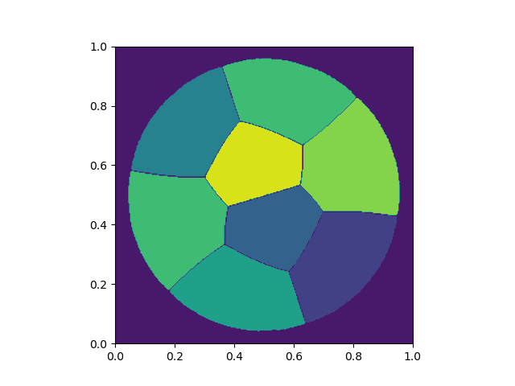

# Optimization-Internship
Optimal Partitioning Problem using spectral Information.
 
For more theoretical results as well as description of the optimization techniques used, please consult the PDF report of the internship.

## How to run the code
- Command Line version  
A window will pop up and display iteratively the partitioning of the grid and will save 5 figures with different resolutions.  
Simply run algo.py in the command line. The arguments that can be used are:
    - -N / --number_partitions : Specifies the number of cells for which we run the Optimal Partitioning. Default: 3  
    - -s / --outer_shape : Specifies the outer shape inside which we run the Optimal Partitioning. Default: 'S' for square.  
    It can take values is {'S', 'D', 'T'}
    - Examples:  
    `python opt_algo.py ` equivalent to `python opt_algo.py -N 3 -s S `  
    `python opt_algo.py -N 8 ` equivalent to `python opt_algo.py -N 8 -s S`  
    `python opt_algo.py -N 6 -s D `

- Jupyter Notebook version  
In a cell, th user is going to have a slider to go through the figures of the different iterations of the optimization algorithm.  
Open Spectra_under_Dirichlet_BC.ipynb and run all the cells. The user can run the simulation shown here multiple times without losing the previous figures as long as they don't change the variable N. This is because changing the other variables is another way to enhance previous data. However changing N is starting a new optimization problem.  
Choose the variables below and then click on `Run`. You can do this multiple times.  
  

Later you can go through the figures of all computed simulations with a slider when running display_simulation()  

## Example of outputs
If we run the command line version, 5 figures will be saved on the same directory from which the user run the algorithm. We show a few samples of these outputs.

`python opt_algo.py -N 6 `

`python opt_algo.py -N 8 `

`python opt_algo.py -N 8 -s D `

`python opt_algo.py -N 7 -s T `

